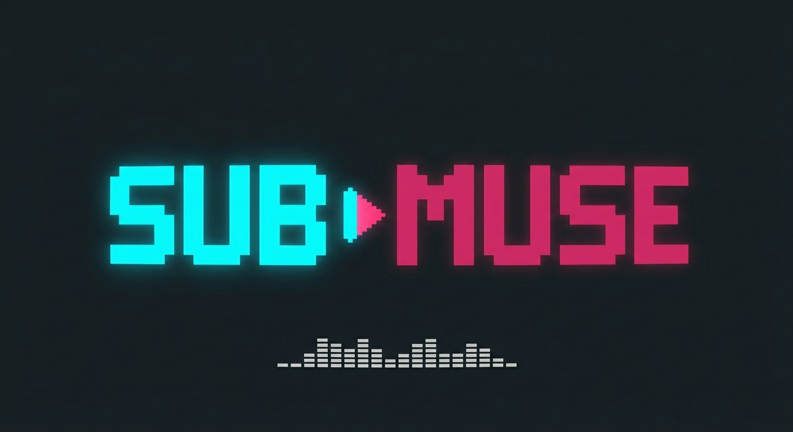

<p align="center">
  
</p>

# Sub-muse

A terminal-based music streaming application for Subsonic-compatible servers, built with Go and Bubbletea.

## Features

- Browse and play music from Subsonic servers
- Playlist management
- Search functionality
- Keyboard shortcuts for navigation and control
- Responsive TUI interface

## Project Structure

```
sub-muse/
├── go.mod
├── go.sum
├── main.go
├── README.md
├── assets/
│   └── icons/
├── internal/
│   ├── config/
│   │   └── config.go
│   ├── player/
│   ├── subsonic/
│   │   ├── client.go
│   │   ├── models.go
│   │   └── api.go
│   └── ui/
│       └── navigation.go
```

## Requirements

- Go 1.19+
- A Subsonic-compatible music server (e.g., Subsonic, Airsonic, Funkwhale)

## Installation

1. Clone the repository:
   ```bash
   git clone https://github.com/yourusername/sub-muse.git
   cd sub-muse
   ```

2. Install dependencies:
   ```bash
   go mod tidy
   ```

3. Build the application:
   ```bash
   go build -o sub-muse .
   ```

## Configuration

Set the following environment variables:
- `SUBSONIC_URL` - Your Subsonic server URL (default: http://localhost:4040)
- `SUBSONIC_USERNAME` - Your Subsonic username
- `SUBSONIC_PASSWORD` - Your Subsonic password
- `SUBSONIC_CLIENT_NAME` - Client name (default: music-tui)

Or create a configuration file at `~/.config/sub-muse/config.yaml` with the following structure:

```yaml
server_url: "http://your-subsonic-server:4040"
username: "your-username"
password: "your-password"
client_name: "sub-muse"
```

## Usage

Run the application:
```bash
./sub-muse
```

## Development

To run the application in development mode:
```bash
go run . dev
```

## Contributing

1. Fork the repository
2. Create a feature branch
3. Commit your changes
4. Push to the branch
5. Open a pull request

## License

MIT